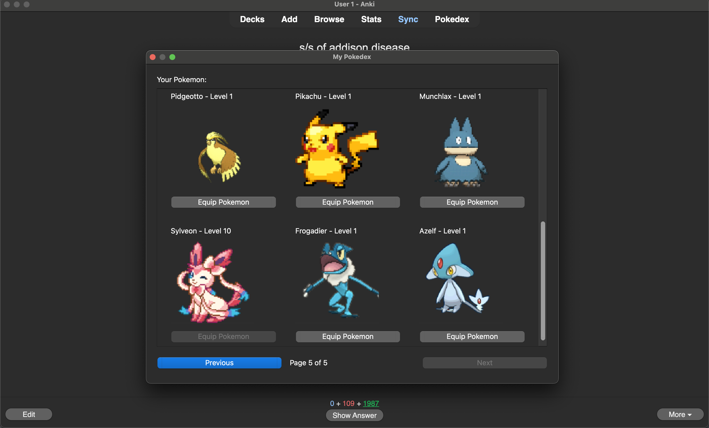
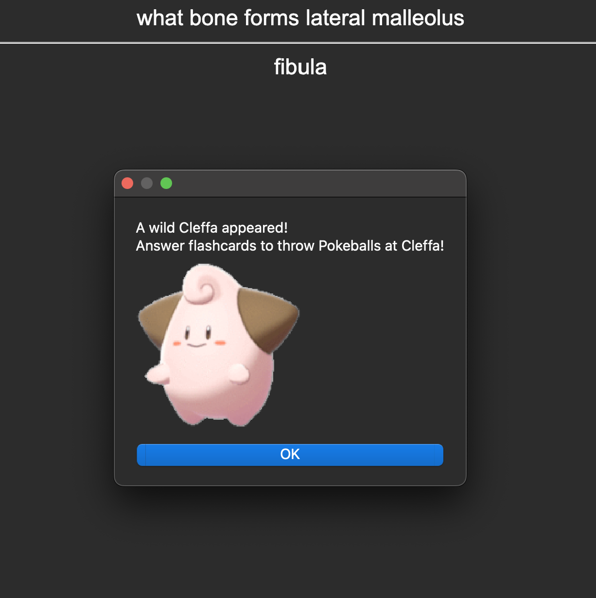
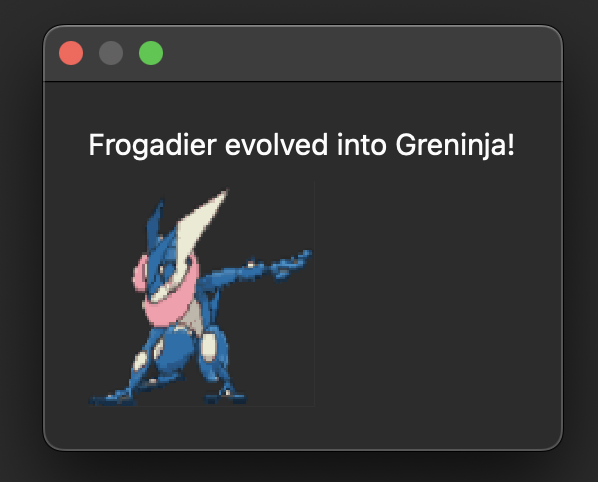

Download here: https://ankiweb.net/shared/info/1977818525

### Welcome to Pokeanki! 
Use this Anki add-on to incorporate the Pokemon game into studying!  
Choose a starter Pokemon to get started, and evolve your starter pokemon as you complete flashcards.  
 
 
 
### Catch and evolve! 
When wild Pokemon appear, throw Pokeballs at them by answering flashcards. Equip different pokemon to evolve them.  
Happy Pokemon catching! 

